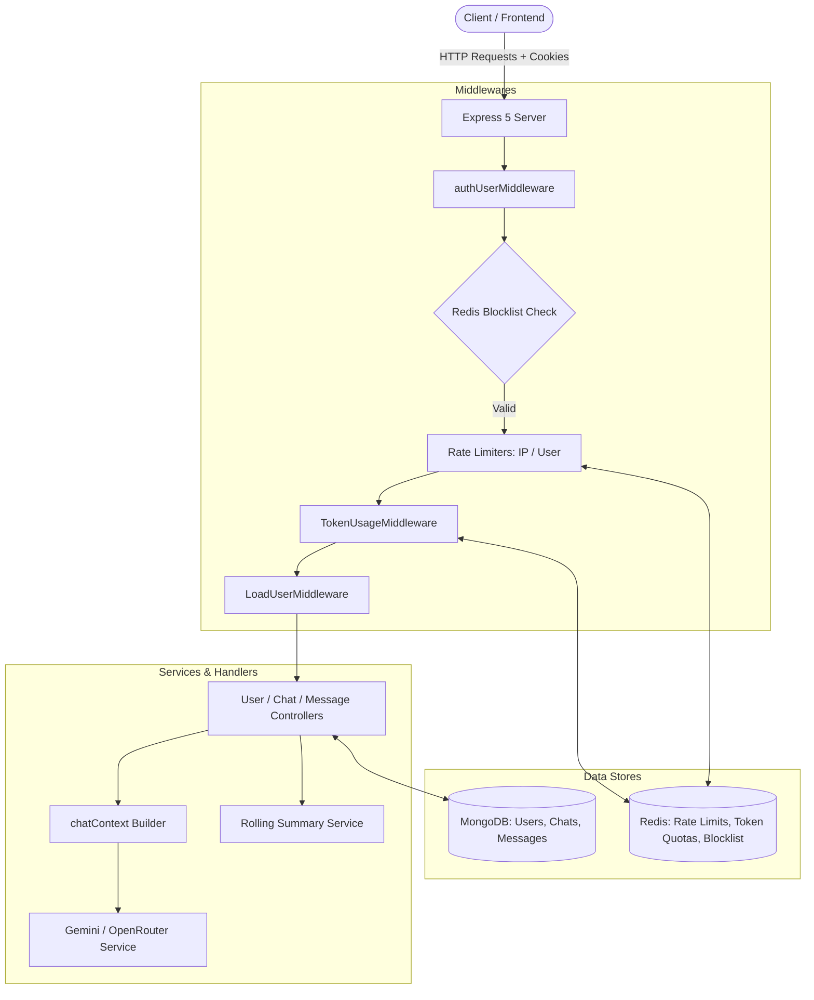

# 🤖 ChatGPT Backend API

A high-performance, modular backend API for a ChatGPT-style conversational platform built with **Node.js**, **Express 5**, **MongoDB (Mongoose)**, **Redis**, and modern AI SDKs (**Google Gemini** & **OpenRouter**).

---

## 📑 Table of Contents

- [Overview](#-overview)
- [Key Features](#-key-features)
- [Architecture & Tech Stack](#-architecture--tech-stack)
- [Project Directory Structure](#-project-directory-structure)
- [Environment Configuration](#-environment-configuration)
- [Installation & Getting Started](#-installation--getting-started)
- [Authentication & Security](#-authentication--security)
- [Rate Limiting & Token Quota System](#-rate-limiting--token-quota-system)
- [Smart Context & Rolling Summarization](#-smart-context--rolling-summarization)
- [AI Providers & Model Selection](#-ai-providers--model-selection)
- [API Reference](#-api-reference)
  - [User Routes (`/user`)](#user-routes-user)
  - [Chat Routes (`/chat`)](#chat-routes-chat)
  - [Message Routes (`/message`)](#message-routes-message)
- [Database Schemas](#-database-schemas)
- [Error Handling & Status Codes](#-error-handling--status-codes)
- [Future Roadmap](#-future-roadmap)
- [License](#-license)

---

## 🌟 Overview

This backend powers an enterprise-grade AI conversational platform. It provides end-to-end management of user authentication, chat sessions, message streaming context, dual-tier rate limiting via Redis, token usage quotas, and automated conversation summarization to optimize AI context window limits.

---

## 🚀 Key Features

- **🔐 Robust Authentication**: JWT-based authentication stored in secure `HTTP-only` cookies, paired with password hashing via `bcrypt` (12 salt rounds).
- **🚫 Token Blocklisting**: Instant logout invalidation via Redis token blacklisting until token expiration.
- **⚡ Dual-Tier Rate Limiting**:
  - **Unauthenticated**: IP-based rate limiting (10 requests / 60s window) for login and signup.
  - **Authenticated**: User-ID-based rate limiting (20 requests / 60s window) across all protected routes.
- **📊 Token Usage & Quota Management**: Tracks user token consumption in real time via Redis sliding counters and persists lifetime token metrics in MongoDB.
- **🧠 Rolling Context Summarization**: Automatically compresses conversation history into a running summary every 20 messages, preserving long-term memory while saving AI prompt tokens.
- **🔄 Multi-Provider AI Support**:
  - **Google Gemini**: Native integration using `@google/genai` (Interactions API).
  - **OpenRouter**: Extensible routing via `@openrouter/sdk` for OpenAI, Anthropic, and open-source models.
- **🛡️ Schema Validation**: Strict input validation and sanitization using **Zod**.
- **⚡ Database Optimization**: Compound indexes on MongoDB collections for high-speed queries on chats and messages.

---

## 🛠️ Architecture & Tech Stack



| Layer | Technologies Used |
| :--- | :--- |
| **Runtime & Framework** | Node.js (ES Modules), Express.js `v5.2.1` |
| **Databases** | MongoDB (Mongoose `v9.8.1`), Redis (`v6.2.1`) |
| **AI SDKs** | `@google/genai` (`v2.16.0`), `@openrouter/sdk` (`v1.2.18`) |
| **Authentication & Security** | `jsonwebtoken`, `bcrypt`, `cookie-parser` |
| **Validation** | `zod` `v4.4.3` |
| **Development** | `nodemon`, `dotenv` |

---

## 📁 Project Directory Structure

```text
├── config/
│   ├── database.js               # MongoDB Mongoose connection handler
│   ├── gemini.js                 # Google GenAI SDK client instance
│   ├── openRouter.js             # OpenRouter SDK client instance
│   └── redis.js                  # Redis client connection and error handlers
├── controllers/
│   ├──  chatController.js        # Chat CRUD operations (get, list, create, delete)
│   ├── msgController.js          # Message processing, AI dispatch, token tracking
│   └── userController.js         # User auth, profile, logout, account deletion
├── middlewares/
│   ├── authUserMiddleware.js     # JWT cookie extraction & Redis blocklist verification
│   ├── authenticatedRateLimiter.js # User-based rate limiter (20 req/min)
│   ├── unauthenticatedRateLimiter.js # IP-based rate limiter (10 req/min)
│   ├── TokenUsageMiddleware.js   # User token quota verification via Redis
│   └── LoadUserMiddleware.js     # Hydrates req.user from MongoDB
├── model/
│   ├── ChatSchema.js             # Chat conversation schema & indexes
│   ├── UserSchema.js             # User account schema & usage metrics
│   └── msgSchema.js              # Message history schema & compound indexes
├── routes/
│   ├── chatRouter.js             # Routes for /chat endpoints
│   ├── msgRouter.js              # Routes for /message endpoints
│   └── userRouter.js             # Routes for /user endpoints
├── services/
│   ├── geminiRouterService.js    # Gemini Interactions API handler & token normalizer
│   ├── openRouterservice.js      # OpenRouter API client & token normalizer
│   └── summaryService.js         # Background conversation summarization logic
├── utils/
│   ├── chatContext.js            # Constructs prompt context (System + Summary + History)
│   ├── ChatToken.js              # Updates chat-level token counters
│   └── userUsage.js              # Updates user lifetime token usage in MongoDB
├── validators/
│   └── userValidator.js          # Zod validation schemas for Signup and Login
├── .env                          # Environment configuration (Private)
├── index.js                      # Application entry point & server bootstrap
├── package.json                  # Dependencies & scripts
└── README.md                     # Project documentation
```

---

## ⚙️ Environment Configuration

Create a `.env` file in the root directory:

```env
# Server Port
PORT=3000

# Database Connection Strings
Mongo_url=mongodb+srv://<username>:<password>@<cluster>.mongodb.net/<dbname>?retryWrites=true&w=majority
Redis=redis://<username>:<password>@<host>:<port>

# Authentication
JWT_key=your_super_secret_jwt_key_here

# Token Quota Settings (Per User)
Token=50000                 # Maximum tokens allowed per cycle
TokenTime=18000000          # Quota TTL duration in milliseconds (e.g., 5 hours = 18000000 ms)

# AI Provider API Keys
GEMINI_API_KEY=your_gemini_api_key_here
OPENROUTER_API_KEY=your_openrouter_api_key_here
```

### Environment Variable Glossary

| Variable | Description |
| :--- | :--- |
| `PORT` | Port on which the Express server listens (e.g., `3000`). |
| `Mongo_url` | Full connection URI for MongoDB instance / cluster. |
| `Redis` / `redis` | Redis connection URL (`redis://...` or `rediss://...`). |
| `JWT_key` | Secret key used to sign and verify JSON Web Tokens. |
| `Token` | User token ceiling limit before requests are rejected with HTTP 429. |
| `TokenTime` | Window in milliseconds for token quota reset in Redis. |
| `GEMINI_API_KEY` | API Key from Google AI Studio. |
| `OPENROUTER_API_KEY` | API Key from OpenRouter. |

---

## 💻 Installation & Getting Started

### 1. Prerequisites
- **Node.js** `>= 18.0.0`
- **MongoDB** instance running locally or via MongoDB Atlas
- **Redis** server running locally or via Redis Cloud

### 2. Clone and Install Dependencies
```bash
git clone https://github.com/Jyndr/ChatGPT
cd ChatGPT
npm install
```

### 3. Start the Server

**Development Mode (Auto-reload with nodemon):**
```bash
npx nodemon index.js
```

**Production Mode:**
```bash
node index.js
```

Server will output:
```text
Connected to Database Successfully
Reddis connected successfully
Server started listening to port 3000
```

---

## 🔒 Authentication & Security

1. **Password Hashing**: Uses `bcrypt` with salt rounds = 12.
2. **JWT Cookie Storage**:
   - Token is signed with `{ expiresIn: "5h" }`.
   - Set as `httpOnly: true` to prevent Cross-Site Scripting (XSS) access.
3. **Instant Logout via Redis Blocklisting**:
   - When `/user/logout` is called, the remaining TTL of the JWT is calculated.
   - The token is added to Redis (`blocklist:<token>` with TTL).
   - `authUserMiddleware` rejects any blacklisted token before it reaches controllers.
4. **Account Cascading Cleanup**:
   - Deleting an account (`DELETE /user/delete`) automatically wipes all messages and chat sessions linked to that `userId` before deleting the user document.

---

## 🚦 Rate Limiting & Token Quota System

### 1. Dual-Tier Redis Rate Limiting
- **Unauthenticated Endpoints** (`/user/signup`, `/user/login`):
  - Key: `rate-limit:ip:<ip_address>`
  - Threshold: Max **10 requests / 60 seconds**.
- **Authenticated Endpoints** (`/chat/*`, `/message/*`, `/user/profile`, etc.):
  - Key: `rate-limit:user:<userId>`
  - Threshold: Max **20 requests / 60 seconds**.

### 2. Token Quota Limiter (`TokenUsageMiddleware`)
- Tracks total prompt and completion tokens consumed per user session in Redis.
- Key: `Token-Usage<userId>`
- If `TokensUsed >= Token`:
  - Returns `429 Too Many Requests`.
  - Informs the client of exact seconds remaining until quota refresh (`redisClient.ttl`).

---

## 🧠 Smart Context & Rolling Summarization

To prevent exceeding AI model context limits and reduce latency:

1. **Context Assembly (`utils/chatContext.js`)**:
   - **System Instruction**: Base system rules and guidelines.
   - **Previous Summary**: Consolidated summary of older conversation turns.
   - **Recent Messages**: Unsummarized raw messages retrieved from MongoDB (`skip(chat.summarizedTillmessageNumber)`).
   - **Current Prompt**: User's new incoming message.
2. **Rolling Summarizer (`services/summaryService.js`)**:
   - Triggers automatically in the background after messages are sent.
   - Once `unsummarizedMessages >= 20`, it takes the next 20 messages, requests the AI to merge them with the previous summary, and saves the updated summary into `ChatSchema`.
   - Increments `chat.summarizedTillmessageNumber` by 20.

---

## 🤖 AI Providers & Model Selection

The system provides a standardized output schema across multiple AI providers:

```json
{
  "ai_reply": "String containing response",
  "usage": {
    "prompt_token": 120,
    "completion_token": 45,
    "total_tokens": 165
  }
}
```

### Supported Providers:

#### 1. Google Gemini (`services/geminiRouterService.js`)
Uses `@google/genai` with `ai.interactions.create`.
- Supported Models: `gemini-2.5-flash`, `gemini-2.5-pro`, `gemma-4-31b-it`.

#### 2. OpenRouter (`services/openRouterservice.js`)
Uses `@openrouter/sdk` for universal multi-model access.
- Supported Models: `openai/gpt-4o-mini`, `anthropic/claude-3.5-sonnet`, `meta-llama/llama-3.3-70b-instruct`, etc.

*To switch active provider, update the import in `controllers/msgController.js` and `services/summaryService.js`.*

---

## 📡 API Reference

### Base URL
```text
http://localhost:3000
```

---

### User Routes (`/user`)

#### 1. User Signup
- **Endpoint**: `POST /user/signup`
- **Rate Limit**: 10 req/min (IP-based)
- **Request Body**:
```json
{
  "name": "Jatin Sharma",
  "age": 22,
  "email": "jatin@example.com",
  "password": "SecurePassword123"
}
```
- **Validation Rules**:
  - `name`: String, 3 to 30 characters.
  - `age`: Number, 10 to 100 (optional).
  - `email`: Valid email format (auto-lowercased & trimmed).
  - `password`: 8 to 30 characters, must contain >=1 uppercase, >=1 lowercase, >=1 digit.
- **Success Response (`201 Created`)**:
  - Sets `Set-Cookie: token=...; HttpOnly`
```json
{
  "message": "user created successfully"
}
```

---

#### 2. User Login
- **Endpoint**: `POST /user/login`
- **Rate Limit**: 10 req/min (IP-based)
- **Request Body**:
```json
{
  "email": "jatin@example.com",
  "password": "SecurePassword123"
}
```
- **Success Response (`200 OK`)**:
  - Sets `Set-Cookie: token=...; HttpOnly`
```json
{
  "message": "User loggedIn successfully",
  "name": "Jatin Sharma",
  "email": "jatin@example.com"
}
```

---

#### 3. User Profile
- **Endpoint**: `GET /user/profile`
- **Auth Required**: Yes (Cookie)
- **Rate Limit**: 20 req/min (User-based)
- **Success Response (`200 OK`)**:
```json
{
  "name": "Jatin Sharma",
  "age": 22,
  "email": "jatin@example.com",
  "usage": {
    "TotalTokenUsed": 15420
  }
}
```

---

#### 4. User Logout
- **Endpoint**: `POST /user/logout`
- **Auth Required**: Yes (Cookie)
- **Description**: Adds JWT to Redis blocklist and clears cookie.
- **Success Response (`200 OK`)**:
```json
{
  "message": "User logged Out succussfully"
}
```

---

#### 5. Delete Account
- **Endpoint**: `DELETE /user/delete`
- **Auth Required**: Yes (Cookie)
- **Description**: Cascading delete for all user's messages, chats, and user profile.
- **Success Response (`200 OK`)**:
```json
{
  "message": "Account deleted Successfully"
}
```

---

### Chat Routes (`/chat`)

*All `/chat` routes require authentication and are limited to 20 req/min per user.*

#### 1. Create New Chat
- **Endpoint**: `POST /chat/createChat`
- **Request Body**:
```json
{
  "model": "gemini-2.5-flash"
}
```
- **Success Response (`200 OK`)**:
```json
{
  "chatid": "66d58e3f9a721c0b82f14a10",
  "userId": "66d58d1e9a721c0b82f14a01",
  "topic": "New Chat"
}
```

---

#### 2. Get Recent Chats
- **Endpoint**: `GET /chat/getRecentChat`
- **Success Response (`200 OK`)**:
```json
{
  "message": "All your recent chats",
  "chats": [
    {
      "_id": "66d58e3f9a721c0b82f14a10",
      "Topic": "JavaScript Closures"
    }
  ]
}
```

---

#### 3. Get Single Chat Details
- **Endpoint**: `GET /chat/:chatId`
- **Params**: `chatId` (MongoDB ObjectId)
- **Success Response (`200 OK`)**:
```json
{
  "chatId": "66d58e3f9a721c0b82f14a10",
  "userId": "66d58d1e9a721c0b82f14a01",
  "topic": "JavaScript Closures"
}
```

---

#### 4. Delete Chat
- **Endpoint**: `DELETE /chat/:chatId`
- **Params**: `chatId` (MongoDB ObjectId)
- **Success Response (`200 OK`)**:
```json
{
  "message": "Your chats are deleted successfully"
}
```

---

### Message Routes (`/message`)

*All `/message` routes require authentication and user-level rate limiting.*

#### 1. Get Message History
- **Endpoint**: `GET /message/:chatId`
- **Params**: `chatId` (MongoDB ObjectId)
- **Success Response (`200 OK`)**:
```json
{
  "message": "Your all msg are here",
  "msg": [
    {
      "_id": "66d58f019a721c0b82f14a22",
      "chatId": "66d58e3f9a721c0b82f14a10",
      "userId": "66d58d1e9a721c0b82f14a01",
      "role": "user",
      "content": "Explain event loop in Node.js",
      "createdAt": "2026-09-02T05:40:17.120Z"
    },
    {
      "_id": "66d58f039a721c0b82f14a23",
      "chatId": "66d58e3f9a721c0b82f14a10",
      "userId": "66d58d1e9a721c0b82f14a01",
      "role": "assistant",
      "content": "The Event Loop in Node.js is what allows Node to perform non-blocking I/O operations...",
      "usage": {
        "promptTokens": 140,
        "completionToken": 85,
        "TotalTokens": 225
      },
      "createdAt": "2026-09-02T05:40:19.450Z"
    }
  ]
}
```

---

#### 2. Send Message / AI Prompt
- **Endpoint**: `POST /message/:chatId`
- **Token Quota Check**: Enforced via `TokenUsageMiddleware`
- **Request Body**:
```json
{
  "content": "Explain closures in JavaScript with code examples",
  "model": "gemini-2.5-flash"
}
```
- **Success Response (`201 Created`)**:
```json
{
  "message": "message sent successfully",
  "chatId": "66d58e3f9a721c0b82f14a10",
  "reply": "A closure in JavaScript is the combination of a function bundled together with references to its surrounding state...",
  "usage": {
    "prompt_token": 182,
    "completion_token": 94,
    "total_tokens": 276
  },
  "TokensUsed": 276,
  "Token_limit": 50000
}
```
- **Rate / Quota Exceeded Response (`429 Too Many Requests`)**:
```json
{
  "message": "try again after 14200 seconds",
  "usage": 50230
}
```

---

## 🗄️ Database Schemas

### 1. User Schema (`model/UserSchema.js`)
| Field | Type | Attributes | Description |
| :--- | :--- | :--- | :--- |
| `name` | `String` | Required | User full name |
| `age` | `Number` | Optional | User age |
| `email` | `String` | Required, Unique, Lowercase | User email address |
| `password` | `String` | Required | Hashed password via bcrypt |
| `usage.TotalTokenUsed` | `Number` | Default: `0` | Cumulative lifetime tokens consumed |
| `timestamps` | `Boolean` | `createdAt`, `updatedAt` | Automatic Mongoose timestamps |

---

### 2. Chat Schema (`model/ChatSchema.js`)
| Field | Type | Attributes | Description |
| :--- | :--- | :--- | :--- |
| `userId` | `ObjectId` | Ref: `User`, Required | Owner of the conversation |
| `Topic` | `String` | Default: `"New Chat"` | Generated conversation title |
| `model` | `String` | Required | Active AI model identifier |
| `summary` | `String` | Default: `""` | Compact history summary |
| `summaryUpdatedAt` | `Date` | Default: `null` | Timestamp of last summary run |
| `summarizedTillmessageNumber`| `Number`| Default: `0` | Index of summarized messages |
| `messageCount` | `Number` | Default: `0` | Total message turns in chat |
| `usage.PromptToken` | `Number` | Default: `0` | Chat prompt token counter |
| `usage.CompletionToken`| `Number` | Default: `0` | Chat completion token counter |
| `usage.TotalTokens` | `Number` | Default: `0` | Total chat token counter |

*Index: `{ userId: 1, updatedAt: -1 }`*

---

### 3. Message Schema (`model/msgSchema.js`)
| Field | Type | Attributes | Description |
| :--- | :--- | :--- | :--- |
| `userId` | `ObjectId` | Ref: `User`, Required | User ID |
| `chatId` | `ObjectId` | Ref: `Chat`, Required | Chat session ID |
| `role` | `String` | Enum: `["user", "assistant"]` | Message sender |
| `content` | `String` | Required | Message text content |
| `tokens` | `Number` | Default: `0` | Token count |
| `usage` | `Object` | `promptTokens`, `completionToken`, `TotalTokens` | Granular token metrics |

*Indexes: `{ chatId: 1, createdAt: 1 }`, `{ userId: 1, createdAt: -1 }`*

---

## ⚠️ Error Handling & Status Codes

| Status Code | Meaning | Example Cause |
| :--- | :--- | :--- |
| **`200 OK`** | Success | Successful GET, login, logout, profile |
| **`201 Created`** | Resource Created | User registered, message posted |
| **`400 Bad Request`** | Validation Error | Missing fields, invalid email format, weak password |
| **`401 Unauthorized`** | Authentication Failure | Missing cookie, expired JWT, or blacklisted token |
| **`403 Forbidden`** | Access Denied | Attempting to access/delete another user's chat |
| **`404 Not Found`** | Resource Not Found | User not found, Chat ID not found |
| **`409 Conflict`** | Duplicate Resource | Email already registered |
| **`429 Too Many Requests`** | Rate or Quota Limit | Exceeded 10/20 req/min or exceeded token ceiling |
| **`500 Internal Error`** | Server Error | AI provider down, DB connection issue |

---

## 🔮 Future Roadmap

- [ ] **Streaming Responses (SSE / WebSockets)**: Real-time chunked token streaming for interactive chat UI.
- [ ] **Dynamic Provider Routing**: Environment-driven auto-fallback between Gemini, OpenRouter, and local LLMs (Ollama).
- [ ] **Multi-modal Support**: Image and file upload attachments with Gemini Vision API.
- [ ] **Conversation Title Auto-Generation**: LLM-driven title generation after the 1st turn.
- [ ] **Unit & Integration Tests**: Comprehensive test suite using Jest / Supertest.
- [ ] **Dockerization**: `Dockerfile` and `docker-compose.yml` for Node, MongoDB, and Redis orchestration.

---

## 📄 License

This project is licensed under the **ISC License**. Feel free to use and customize for your own projects!
